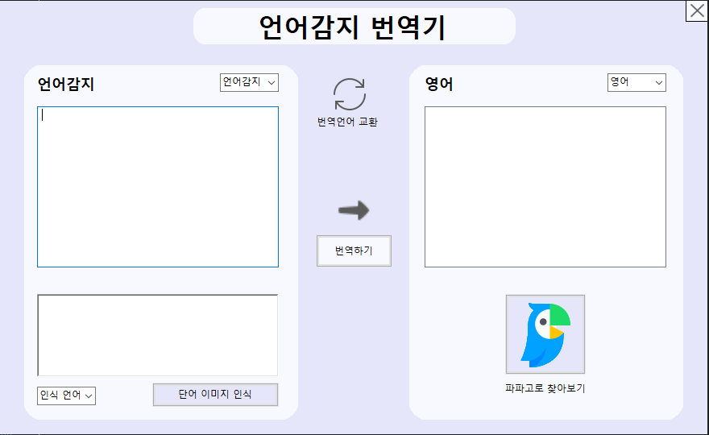
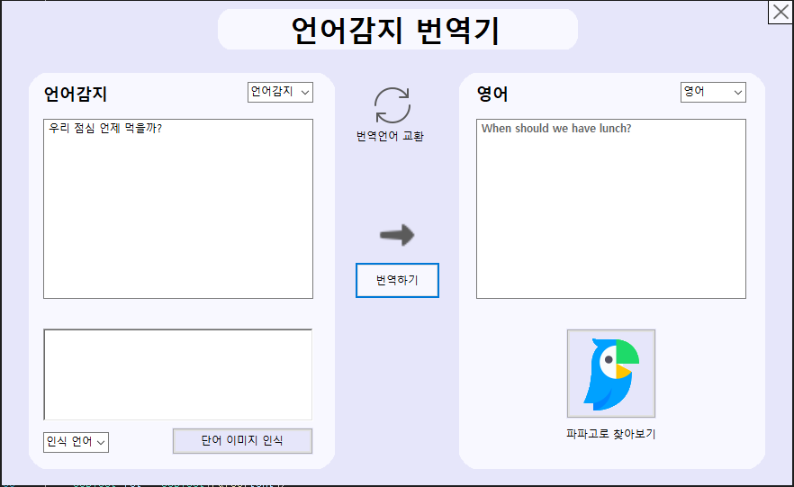
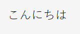
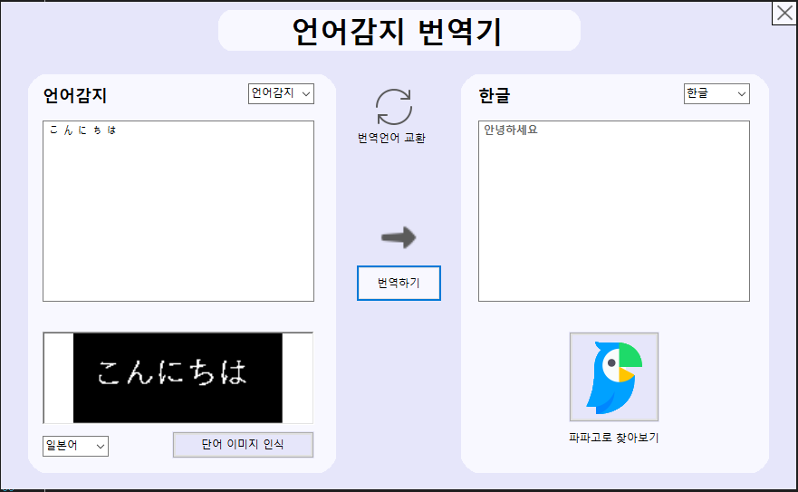
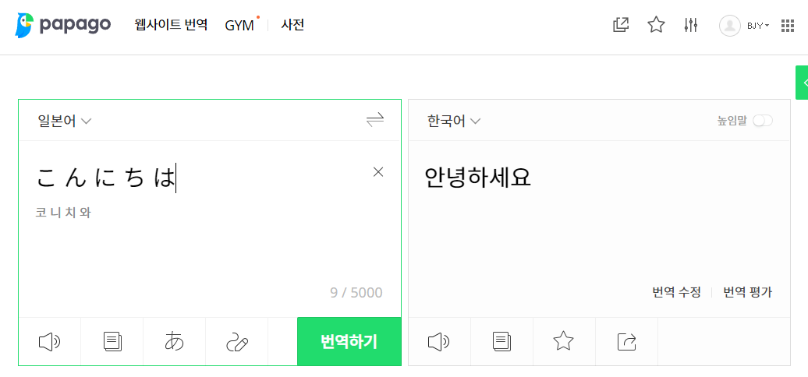
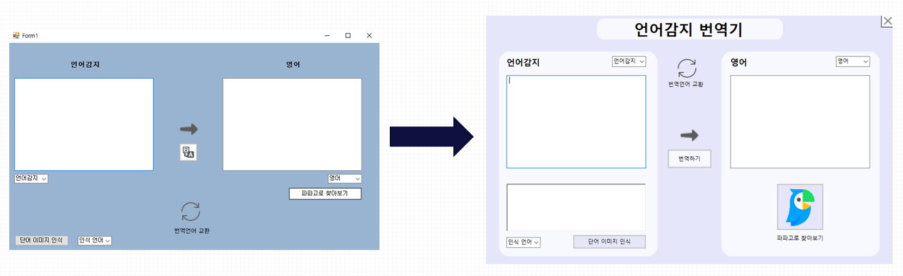

# 💡 C# 언어번역 프로그램
- Visual Studio 2022에서 사용해 진행하였습니다.
- 네이버의 파파고 API를 활용하였습니다.
- 이미지 인식을 위해 오픈 소스 OCR인 테서랙트 OCR엔진을 사용하였습니다.

<br>

# <제작기간 및 개발 인원>
- 기간 : 2022.01 ~ 2022.01 (약 1주)
- 인원 : 3명
- 담당 역할 : Winform을 활용한 UI구현

<br>

## <주요 기능>

#### * 언어번역
- 번역기 API를 이용하여 입력된 텍스트를 전송합니다.
- 번역된 텍스트를 JSON형식으로 받아와 프로그램에 출력됩니다.



```
HttpWebRequest request = (HttpWebRequest)WebRequest.Create(url);

//Header에 정보 추가
request.Headers.Add("X-Naver-Client-Id", " ");
request.Headers.Add("X-Naver-Client-Secret", " ");
request.Method = "POST";
tring query = textBox1.Text; //번역하고자 하는 문장.

//source ko, target en 한->영 query문장을 번역.
byte[] byteDataParams = Encoding.UTF8.GetBytes("source=" + source + "&target=" + target + "&text=" + query);

request.ContentType = "application/x-www-form-urlencoded";
request.ContentLength = byteDataParams.Length;
//request
Stream rqstream = request.GetRequestStream();
rqstream.Write(byteDataParams, 0, byteDataParams.Length);
rqstream.Close();

//response
HttpWebResponse response = (HttpWebResponse)request.GetResponse();
Stream rpstream = response.GetResponseStream();
StreamReader reader = new StreamReader(rpstream, Encoding.UTF8);

string text = reader.ReadToEnd();

//Json parsing
JObject ret = JObject.Parse(text);
textBox2.Text = ret["message"]["result"]["translatedText"].ToString(); //message
```

- 번역 되는 언어를 선택하지않아도 자동으로 감지합니다.


```
string url2 = "https://openapi.naver.com/v1/papago/detectLangs";
HttpWebRequest request2 = (HttpWebRequest)WebRequest.Create(url2);
//Header에 정보 추가
request2.Headers.Add("X-Naver-Client-Id", " ");
request2.Headers.Add("X-Naver-Client-Secret", " ");
request2.Method = "POST";
string query2 = textBox1.Text; //감지하고자 하는 문장.

//query문장을 감지
byte[] byteDataParams2 = Encoding.UTF8.GetBytes("query=" + query2);

request2.ContentType = "application/x-www-form-urlencoded";
request2.ContentLength = byteDataParams2.Length;
//request
Stream rqstream2 = request2.GetRequestStream();
rqstream2.Write(byteDataParams2, 0, byteDataParams2.Length);
rqstream2.Close();

//response
HttpWebResponse response2 = (HttpWebResponse)request2.GetResponse();
Stream rpstream2 = response2.GetResponseStream();
StreamReader reader2 = new StreamReader(rpstream2, Encoding.UTF8);

string text2 = reader2.ReadToEnd();

//Json parsing
JObject ret2 = JObject.Parse(text2);
string source = ret2["langCode"].ToString().Trim(); //message
return source;
```

#### 이미지 번역
- OCR엔진이 쉽게 인식하게하기 위해 이미지의 픽셀을 이진화하여 검은색과 흰색으로만 표현되는 이미지를 만들어줍니다.
- 계산된 데이터를 result에 담아 정보를 추출하여 문자열을 텍스트박스에 담아줍니다.




```
 Bitmap bmp = new Bitmap(imgfile);
pictureBox1.Image = bmp;


//binary 이미지를 읽기 쉽도록 이진화 (픽셀당 색값과 명암값을 없앤다)
for (int i = 0; i < bmp.Width; i++)
{
     for (int j = 0; j < bmp.Height; j++)
      {
          Color c = bmp.GetPixel(i, j);
          int binary = (c.R + c.G + c.B) / 3;

          if (binary > 200)
               bmp.SetPixel(i, j, Color.Black);
          else
               bmp.SetPixel(i, j, Color.White);
      }
}

Pix pix = PixConverter.ToPix(bmp);
try
{
      var engine = new TesseractEngine(@"./tessdata", language, EngineMode.TesseractAndLstm);  //tessdata(문자인식 세팅값) 위치
      var result = engine.Process(pix);

      textBox1.Text = result.GetText().TrimStart();  //공백 제거하여 텍스트박스에 삽입

      pictureBox1.Image = pictureBox1.Image;

}
catch
{
      MessageBox.Show("실행파일이 있는 폴더에 tessdata 폴더를 삽입해주세요!!");
}
```

#### URL을 통한 번역내용 검색
- URL을 통해 번역할 언어, 번역될 언어, 번역할 텍스트를 전송하여 파파고에서 직접 단어 정보를 검색해 볼 수 있도록 구현하였습니다.



```
string source = "ko", target = "en";

switch (comboBox1.Text)
{
  case "한글":
    source = "ko";
    break;
  case "영어":
    source = "en";
    break;
  case "일본어":
    source = "ja";
    break;
  default:
    source = Aoto();
    break;
}
switch (comboBox2.Text)
{
  case "한글":
    target = "ko";
    break;
  case "영어":
    target = "en";
    break;
  case "일본어":
    target = "ja";
    break;
}

if (textBox1.Text == "")
{
    System.Diagnostics.Process.Start("https://papago.naver.com/");
}
else
{
    System.Diagnostics.Process.Start($"https://papago.naver.com/?sk={source}&tk={target}&st={textBox1.Text}");
}
```

#### 디자인 
- 버튼 디자인, 오브젝트 배치와 화면 구성 제작하여 새로운 폼 디자인으로 설계하였습니다.
- 사용자의 편의와 가시성을 확대시켰습니다.



# 😘 감사합니다.
